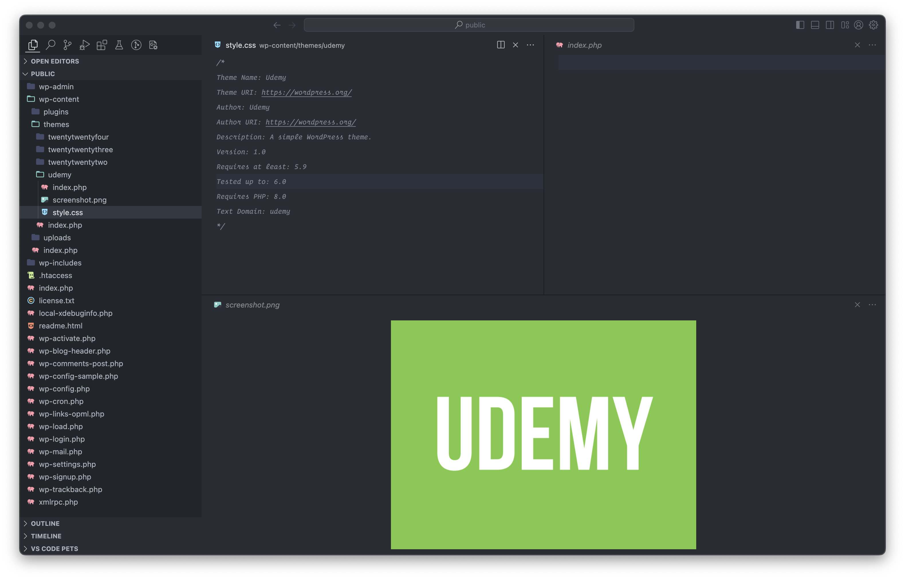

# 1. Complete WordPress Developer Course 2023 - Plugins & Themes

- [1. Complete WordPress Developer Course 2023 - Plugins \& Themes](#1-complete-wordpress-developer-course-2023---plugins--themes)
  - [1.1. Getting started](#11-getting-started)
    - [1.1.1. What to expect](#111-what-to-expect)
    - [1.1.2. What is an environment?](#112-what-is-an-environment)
    - [1.1.3. Installing WordPress](#113-installing-wordpress)
    - [1.1.4. `Local` quick tour](#114-local-quick-tour)
    - [1.1.5. Text editors](#115-text-editors)
  - [1.2. PHP Fundamentals](#12-php-fundamentals)
    - [1.2.1. Introduction to PHP](#121-introduction-to-php)
    - [1.2.2. Variables](#122-variables)
    - [1.2.3. Strings and Booleans](#123-strings-and-booleans)
    - [1.2.4. Functions](#124-functions)
    - [1.2.5. Arrays](#125-arrays)
    - [1.2.6. Loops](#126-loops)
    - [1.2.7. Constants](#127-constants)
    - [1.2.8. Understanding Errors](#128-understanding-errors)
    - [1.2.9. Comments](#129-comments)
  - [1.3. Kickstarting a Theme](#13-kickstarting-a-theme)
    - [1.3.1. Exploring the WordPress Configuration](#131-exploring-the-wordpress-configuration)
    - [Adjusting the configuration](#adjusting-the-configuration)
    - [WordPress File and Folders](#wordpress-file-and-folders)
    - [File Headers](#file-headers)

## 1.1. Getting started

### 1.1.1. What to expect

- Custom post types
- Extending the REST API
- Translations
- Block development
- Custom database tables
- Transients
- Data sanitization
- Code optimization
- ...

### 1.1.2. What is an environment?

- Learn why it's important to have an environment for WordPress
- A location where your code runs
- **Production**: Publicly accessible, managed by a company
- **Development**: Private, managed by developer, using `Local` tool to config WP dev environment

### 1.1.3. Installing WordPress

- Installing WordPress through `Local`
- WordPress needs 3 programs to run:
  - PHP
  - Web Server
  - Database

- PHP is a programming language. Generally, programming languages can give instructions to machines to perform various actions.
- A web server is responsible for exposing files via an HTTP URL
- A database is a program for storing info

### 1.1.4. `Local` quick tour

- Select site
- Change site domain
- SSL certificate
- Folders
  - `conf`: configuration
  - `log`: logs
  - `app`: website

### 1.1.5. Text editors

In this course, I'll be using a text editor called Visual Studio Code.

## 1.2. PHP Fundamentals

### 1.2.1. Introduction to PHP

PHP: it's a programming language that runs on servers to process web pages. A programming language
allows us to give instructions to a machine.

### 1.2.2. Variables

> Variables allow us to store values.

Syntax: the rules for how a programming language is written
    - The `$` symbol tells PHP to create a variable
    - Another way of saying it is declaring a variable

Variable naming rules
    - A variable must start with a letter or underscore character
    - A variable name cannot start with a number
    - A variable name can only contain alpha-numeric characters and underscores

```php
<?php 
    $age = 23;
    echo $age;
?>
```

### 1.2.3. Strings and Booleans

Data can be categorized. Aside from numbers, we can also use strings and booleans.

Data types:
    - Categories for data
    - Integer
    - Float
    - String
    - Boolean
    - Array
    - Object
    - Null

```php
<?php 
    $name = 'Hieu Nguyen Trong';
    echo $name;

    $isLoggedIn = true;
    echo $isLoggedIn;
?>
```

### 1.2.4. Functions

A function is a block of code that can perform a specific task.

- **Parameters** - The variable in the declaration of the function
- **Argument** - The value of the variable that gets passed to the function

```php
<?php 
    function greeting($message) {
        echo $message;
    }

    greeting('Hello World');
?>
```

### 1.2.5. Arrays

PHP array can store a collection of data.

```php
<?php 
    $foods = array('Pizza', 'Hamburger', 'Sushi');

    echo $foods[0];
    echo $foods[1];
    echo $foods[2];
?>
```

### 1.2.6. Loops

Using loops to iterate through the array

```php
<?php 
    $foods =['Pizza', 'Hamburger', 'Sushi'];

    $count = 0;
    while($count < count($foods)) {
        echo $foods[$count];
        $count += 1;
    }

?>
```

### 1.2.7. Constants

A constant is a variable that cannot have its value updated.
Constants can be reliable for storing data that never needs to change.

```php
<?php 
    define('NAME', 'Hieu Nguyen Trong');
    echo NAME;
?>
```

### 1.2.8. Understanding Errors

```php
<?php 
    define('NAME', 'Hieu Nguyen Trong');
    echo NAME;

    // errors
    define('NAME', 'Errors');
?>
```

### 1.2.9. Comments

```php
<?php 
    // Single-line comment
    define('NAME', 'Hieu Nguyen Trong');

    /*
     *  Multiline
     *  comment
     */
    echo NAME;
?>
```

## 1.3. Kickstarting a Theme

### 1.3.1. Exploring the WordPress Configuration

The configuration file is loaded on every request.

It can be found in the root directory of your WordPress installation, the file is called `wp-config.php`

WordPress configuration settings are defined with constants.

### Adjusting the configuration

Enable debug mode in WordPress

```php
<?php 
    define('WP_DEBUG', true);
    define('WP_DISABLE_FATAL_ERROR_HANDLER', true);
?>
```

### WordPress File and Folders

The files in the root directory contain code for preparing WordPress. WordPress needs to go through a few phases before delivering a page to the user.

These files are responsible for delivering the pages on the front side of WordPress.

3 folders:

- `wp-admin`: contains code for `Admin` dashboard
- `wp-content`: plugins, themes and media files can be found inside this directory
- `wp-includes`: process data

Don't edit files outside the `wp-content` directory, WordPress may override your changes.
The exception to this rule is the `wp-config` file.

### File Headers

Register a theme with WordPress.

By default, every WordPress installation will come with a couple of themes. In every case, one theme must be present and active.

WordPress will always search for your themes in the themes directory.

Create a new theme folder called `Udemy`.

WordPress has 3 requirements for registering a new theme

- Create 2 files:
  - `sytle.css`: file header
  - `index.php`

[File Header](https://developer.wordpress.org/themes/basics/main-stylesheet-style-css/)

```css
/*
Theme Name: Twenty Twenty
Theme URI: https://wordpress.org/themes/twentytwenty/
Author: the WordPress team
Author URI: https://wordpress.org/
Description: Our default theme for 2020 is designed to take full advantage of the flexibility of the block editor. Organizations and businesses have the ability to create dynamic landing pages with endless layouts using the group and column blocks. The centered content column and fine-tuned typography also makes it perfect for traditional blogs. Complete editor styles give you a good idea of what your content will look like, even before you publish. You can give your site a personal touch by changing the background colors and the accent color in the Customizer. The colors of all elements on your site are automatically calculated based on the colors you pick, ensuring a high, accessible color contrast for your visitors.
Tags: blog, one-column, custom-background, custom-colors, custom-logo, custom-menu, editor-style, featured-images, footer-widgets, full-width-template, rtl-language-support, sticky-post, theme-options, threaded-comments, translation-ready, block-styles, wide-blocks, accessibility-ready
Version: 1.3
Requires at least: 5.0
Tested up to: 5.4
Requires PHP: 7.0
License: GNU General Public License v2 or later
License URI: http://www.gnu.org/licenses/gpl-2.0.html
Text Domain: twentytwenty
This theme, like WordPress, is licensed under the GPL.
Use it to make something cool, have fun, and share what you've learned with others.
*/
```

- `Text domain`: is very important in regards to translations. You can think of the text domain as a unique ID for our translation. It's common practice to set the text domain to the same name as your folder.

WordPress will search for a file called `screenshot.png`. The image should be a screenshot of your theme, but an image with a logo works too.

The recommended dimensions of your image should be `1200x900`


